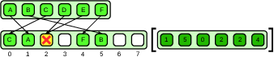
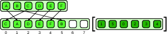
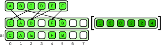
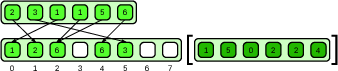
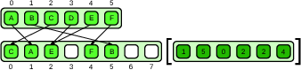

# Table of Contents

1.  [Scatter](#org1861adf)
    1.  [Theory](#orgb31d208)
    2.  [Algorithms](#orgc00e341)
    3.  [Data](#org2f99a20)
    4.  [Notes](#org9d45efe)

# Scatter

## Theory

### Introduction

The scatter pattern is another parallel access pattern and the inverse of the gather pattern.
One is given a set of input data and a set of indices defining where the input data is to written.
The scatter operation is completely defined by `output[idx[i]] = input[i]`.
However, unlike gather, scatter is ill-defined when duplicate write addresses appear, see Fig. [2](#org3b9a8ab).

It is unclear how such collisions should be resolved without any rules.
There are four simple solutions being presented in [Variants](#orge23eca1).

The simplest serial version of scatter is shown [below](#orgc0472bf).

    template <typename Data = double, typename Idx = size_t>
    void scatter(vector<Data> &input, vector<Idx> &idx, vector<Data> &output)
    {
      auto N = idx.size(); // get index size
      for (auto i = 0; i < N; ++i) {
        auto j = idx[i]; // get ith index;
        assert(0 <= j && j < N); //check bounds
        output[j] = input[i]; // perform random write
      }
    }

### Variants

1.  Permutation

    The simplest scatter variant is declaring all collisions illegal, e.g. `vector<Idx> idx` [above](#orgc0472bf) does not contain duplicates.
    This is called permutation scatter, see Fig. [7](#orgcc4646e).
    Permutation scatter should generally check if the inputs provided contain collisions (we did not, we trust ourselves).
    Since the operations are all independent, parallelizing is easy.
    
    Side-note: This is the algorithm we implemented.
    
    

2.  Atomic

    Another access pattern is the atomic scatter pattern.
    It is defined by writing atomically to the output data, e.g. `vector<atomic<Data>> &output` [above](#orgc0472bf).
    But the atomic scatter results in undefined behavior, see Fig. [9](#orgf55669a)!
    When colliding only one value will end up being observed, all other previous writes will essentially discarded.
    It is only deterministic iff all input data written to the same location have the same value.
    Since the programmer has already accepted having undefined behavior, parallelizing is easy.
    
    

3.  Merge

    If the underlying operators to resolve collisions are associative and commutative, the scatter is again well defined.
    Armed with these properties the order of execution does not matter.
    This is called merge scatter, see Fig. [11](#org532c6f9).
    One danger is, that the algorithm depends on programmers to check these algebraic properties.
    Parallelizing relies on synchronization of writes to same write address.
    
    

4.  Priority

    The last solution is to assign each collision a property called priority.
    Upon collision the algorithm checks what value has a higher priority and only writes new values if the priority is higher.
    This is called priority scatter, see Fig. [13](#orgf51f668).
    Parallelizing relies on synchronization of writes to same write address.
    
    

### Expectations

The first impression data should come into mind looking at [1](#orgc0472bf), is that there are no dependencies in the loop.
Meaning that this operation is highly parallizeable in case of permutation scatter.

The second thing that comes to mind is false sharing across on cache lines in NUMA architectures.
Writes to neighboring addresses invalidates cache entries on different CPUs.
However, in our case this is highly unlikely since we have $2^{30}$ input elements.
Thus , it is highly unlikely that addresses of our writes on different CPUs are neighboring.

## Algorithms

## Data

## Notes

